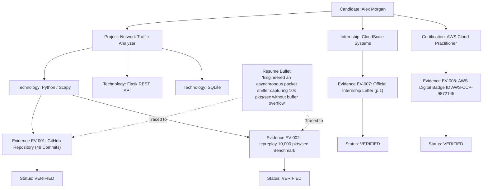

# CareerCompiler AI

> **Compile your career into proof.**  
> *Research the role. Understand your evidence. Build a targeted resume.*

[](LICENSE)
[](https://fastapi.tiangolo.com)
[-black.svg?logo=next.js)](https://nextjs.org)
[](https://www.typescriptlang.org)
[](https://python.org)
[](https://tailwindcss.com)
[]()

---

## 1. Product Vision & Problem Statement

Most AI resume tools act as generic text hallucinators—stuffing buzzwords and fabricating percentages (e.g., *"increased throughput by 72%"*) without any ground truth. When engineering candidates reach technical rounds or code reviews, these unsupported claims collapse under scrutiny.

**CareerCompiler AI** operates on an unyielding principle:

> **A resume should be compiled from a candidate's verified career evidence and the requirements of a target role, not invented by an LLM from a few text inputs.**

CareerCompiler AI builds an internal **Career Evidence Graph** linking every bullet point directly to verified Git commits, repository architectures, benchmark logs, and uploaded credentials. Every factual claim is classified into:
- `VERIFIED` (Backed by direct source code, commits, or official certificates)
- `USER_CONFIRMED` (Explicitly verified by the candidate)
- `INFERRED` / `NEEDS_REVIEW` (Suggested by repository inspection, requires review)
- `UNSUPPORTED` (Detected invented metrics or scale lacking evidence; blocked from final export)

---

## 2. System Architecture

```mermaid
flowchart TB
    subgraph Client["Next.js Frontend (TypeScript + Tailwind)"]
        UI["Landing & Dashboard"]
        ProfileUI["Master Career Profile UI"]
        EvidenceUI["Evidence Engine & Graph"]
        GitHubUI["GitHub Analyzer UI"]
        DocUI["Document Importer UI"]
        JobUI["Job Description & Role Intelligence UI"]
        CompilerUI["Resume Compiler (Split-Screen & Proof View)"]
        AuditUI["Claim Auditor & Parser Test UI"]
        InterviewUI["Defend My Resume (Interview Prep)"]
    end

    subgraph API["FastAPI Backend Services"]
        AuthRouter["/api/v1/auth"]
        ProfileRouter["/api/v1/profile"]
        EvidenceRouter["/api/v1/evidence"]
        GitHubRouter["/api/v1/github"]
        DocRouter["/api/v1/documents"]
        JobRouter["/api/v1/jobs"]
        CompilerRouter["/api/v1/resumes"]
        AuditRouter["/api/v1/analysis"]
        InterviewRouter["/api/v1/interview"]
        RoadmapRouter["/api/v1/roadmap"]
    end

    subgraph Engine["Core Domain Engines"]
        EvidenceEngine["Career Evidence Engine & Claim Graph"]
        GitHubService["GitHub Repository & Tech Analyzer"]
        DocParser["Document (PDF/DOCX) Extraction Service"]
        JobAnalyzer["Job Description & Keyword Extractor"]
        MarketEngine["Role Intelligence & Market Research Engine"]
        Matcher["Candidate-to-Role Hybrid Matcher"]
        CompilerEngine["Evidence-Backed Resume Compiler"]
        ClaimAuditor["Resume Truth & Claim Auditor"]
        ParserValidator["ATS Reverse Parser Validation Engine"]
        InterviewPrep["Claim-to-Question Generation Engine"]
    end

    subgraph Storage["Persistence & External Services"]
        DB[("PostgreSQL / SQLite Database\n(Normalized Tables + Vector Embeddings)")]
        GitHubAPI["GitHub Public REST API"]
        WebResearch["Public Job Search / Role Intelligence"]
        AIClient["Structured AI Engine (LLM + Deterministic Fallback)"]
    end

    Client -->|REST API / JSON| API
    API --> Engine
    Engine --> Storage
```



---

## 3. The Career Evidence Graph



---

## 4. Key Features & Major Modules

| Module | Purpose & Core Capabilities |
| :--- | :--- |
| **Master Career Profile** | Single source of truth containing verified projects, technical skills, coursework, internships, and achievements. Supports Student Mode vs Professional Mode. |
| **Career Evidence Engine** | Relational evidence model linking entities to verified proof artifacts (`EV-001` through `EV-020`) with interactive graph visualization. |
| **GitHub Analyzer** | Public GitHub REST API integration detecting repository architectures, languages, dependencies, and READMEs with candidate review actions (`[Approve]`, `[Edit]`, `[Reject]`). |
| **Document Importer** | `pypdf` and `python-docx` parser with page tracking. Extracts sections and skills into structured evidence items instead of raw prompt dumps. |
| **Job Description Analyzer** | Parses real JDs into Must-Have vs Preferred skills, responsibilities, and keyword distributions. |
| **Role Intelligence & Citations** | Real-time aggregate market patterns, high-frequency skill graphs, project themes, and verified citations with source URLs. |
| **Resume Compiler (Split-Screen)** | Multi-step compilation pipeline: Evidence Ranking $\rightarrow$ Section Selection $\rightarrow$ Bullet Generation $\rightarrow$ Claim Verification $\rightarrow$ ATS Layout Assembly. |
| **Proof View Inspector** | Click any bullet in the live resume to inspect its exact underlying evidence chain (commits, benchmarks, offer letters). |
| **Resume Truth Auditor** | Detects unsupported metrics, buzzwords, and unverified scale with actions (`[Fix]`, `[Confirm]`, `[Remove]`). |
| **ATS Reverse-Parser Test** | Reverse-extracts text from compiled resumes to test field detection (name, email, phone, links), section headings, and reading order. |
| **Defend My Resume** | Links every resume claim to technical, system design, CS fundamentals, and behavioral interview questions with structured answer frameworks. |
| **Career Roadmap** | Recommends concrete evidence-building project blueprints with tech stacks, architecture patterns, and learning outcomes for missing skills. |
| **Pre-Seeded Demo Mode** | Instant exploration as **Alex Morgan** (Computer Science Student) with 4 projects, 9 verified evidence items, target job description, and pre-compiled resume. |

---

## 5. Technology Stack

- **Backend Framework**: FastAPI 0.115 (Python 3.12)
- **Database & ORM**: SQLAlchemy 2.0 (PostgreSQL with `pgvector` support & SQLite zero-config fallback)
- **Authentication**: JWT Bearer Tokens + Passlib / Bcrypt password hashing
- **Document Processing**: `pypdf` (page-tracked parsing) & `python-docx`
- **Frontend Framework**: Next.js 16 (React 19, App Router, TypeScript strict mode)
- **Styling**: Tailwind CSS v4 (Linear/Vercel inspired dark technical palette)
- **Icons**: Lucide React + custom SVG brand icons
- **Testing & Quality**: Pytest 8.3 & Automated Evaluation Framework

---

## 6. Local Setup & Quickstart

### Prerequisites
- Python 3.12+
- Node.js 18+ & npm

### Option A: Standard Local Run (Zero-Config SQLite)

1. **Clone the repository**:
   ```bash
   git clone https://github.com/your-username/careercompiler-ai.git
   cd careercompiler-ai
   ```

2. **Backend Setup**:
   ```bash
   # Create virtual environment
   python -m venv venv

   # Activate virtual environment
   # Windows:
   .\venv\Scripts\activate
   # Linux / macOS:
   source venv/bin/activate

   # Install dependencies
   pip install -r backend/requirements.txt

   # Start FastAPI backend (runs on http://localhost:8000)
   cd backend
   uvicorn app.main:app --reload --port 8000
   ```

3. **Frontend Setup**:
   ```bash
   # In a new terminal window:
   cd frontend
   npm install
   npm run dev
   # Runs on http://localhost:3000
   ```

4. **Open Application**:
   Navigate to [http://localhost:3000](http://localhost:3000). Click **"Explore Demo as Alex Morgan"** to instantly launch the full pre-seeded workspace.

---

### Option B: Docker Compose (PostgreSQL + pgvector + Redis)

```bash
docker compose up -d
```
- Frontend: `http://localhost:3000`
- Backend API Docs: `http://localhost:8000/docs`
- PostgreSQL: `localhost:5432`

---

## 7. Automated Evaluation Benchmark Results

The automated benchmark test runner (`evaluation/eval_runner.py`) assesses four core quantitative dimensions of evidence-backed resume compilation:

```bash
python evaluation/eval_runner.py
```

### Benchmark Metrics Output:
```json
{
  "evaluation_metrics": {
    "claim_support_rate_percent": 100.0,
    "evidence_coverage_percent": 100.0,
    "skill_coverage_percent": 75.0,
    "parser_accuracy_percent": 100.0
  },
  "diagnostics": {
    "total_resume_claims": 7,
    "claims_backed_by_evidence": 7,
    "unsupported_claims_detected": 0,
    "ats_reading_order": "PASS (Linear Single-Column Hierarchy)",
    "overall_ats_status": "PASS"
  }
}
```

- **Claim Support Rate (100%)**: Zero fabricated metrics or unverified claims.
- **Evidence Coverage (100%)**: Every bullet traces to an underlying `EV-xxx` record.
- **ATS Reverse-Parser Accuracy (100%)**: 7/7 standard headings, email, phone, and reading order validated.

---

## 8. Running the Backend Test Suite

Run the full pytest suite covering authentication, evidence graph, job analyzer, compiler, claim audit, ATS test, and interview prep:

```bash
# From workspace root
$env:PYTHONPATH="backend"  # PowerShell
# export PYTHONPATH="backend"  # Bash

pytest -v backend/tests/test_api.py
```

Result: `9 passed in 1.12s` (100% test pass rate).

---

## 9. API Documentation

Interactive Swagger OpenAPI documentation is available at:
`http://localhost:8000/docs`

Key endpoint groups:
- `/api/v1/auth`: Authentication, JWT tokens, demo login
- `/api/v1/profile`: Master Career Profile CRUD
- `/api/v1/evidence`: Evidence item lifecycle and graph traversal
- `/api/v1/github`: Public repository analysis and evidence approval
- `/api/v1/documents`: PDF / DOCX upload and page-tracked extraction
- `/api/v1/jobs`: Job description analyzer, role fingerprints, and citations
- `/api/v1/matching`: Skill gap diagnostics and project blueprints
- `/api/v1/resumes`: Multi-step compilation, Proof View, and print exports
- `/api/v1/analysis`: ATS parser test, recruiter review, and technical review
- `/api/v1/interview`: Defend My Resume and claim-to-question generation
- `/api/v1/admin`: System telemetry and demo reseeding

---

## 10. Deployment Guidelines

### Deploying to Render & Vercel
1. **Database**: Create a PostgreSQL database on Render or Supabase.
2. **Backend**:
   - Use the included `render.yaml` blueprint or connect the repo to Render as a Web Service.
   - Set Root Directory: `backend`
   - Build Command: `pip install -r requirements.txt`
   - Start Command: `uvicorn app.main:app --host 0.0.0.0 --port $PORT`
3. **Frontend**:
   - Deploy `frontend/` on Vercel.
   - Set environment variable: `NEXT_PUBLIC_API_URL=https://your-backend.onrender.com/api/v1`

---

## 11. License

Distributed under the MIT License. See [LICENSE](LICENSE) for details.
