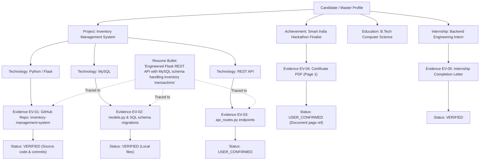
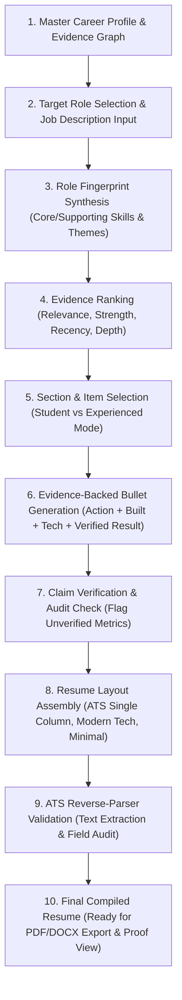
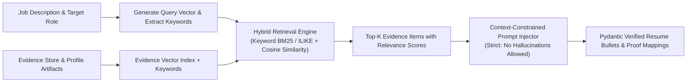
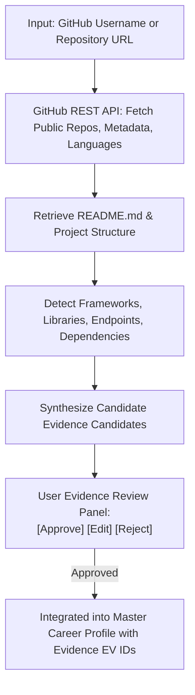
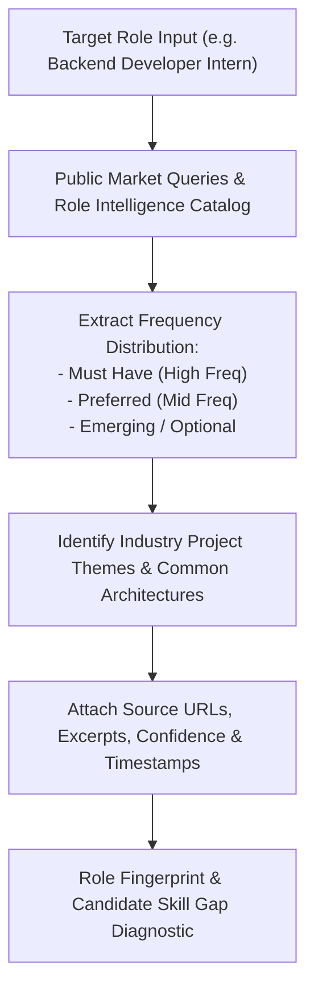
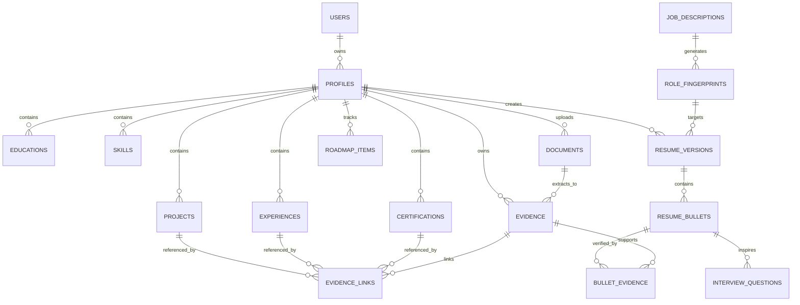
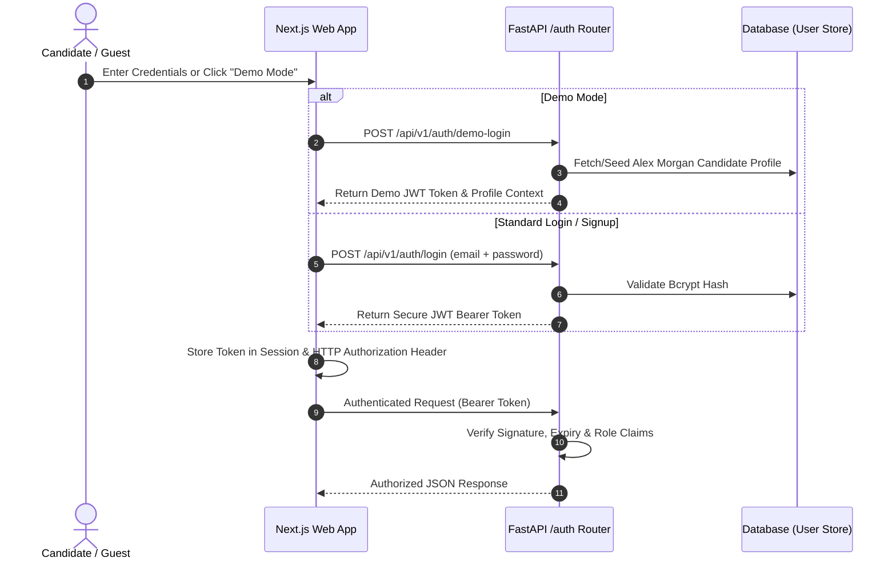
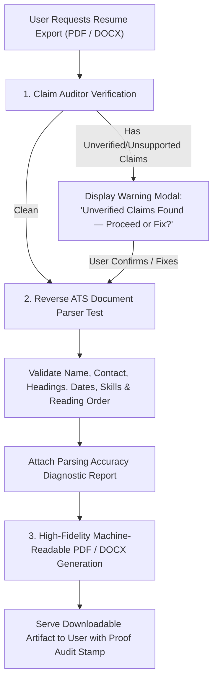

# CareerCompiler AI — System Architecture & Specification

## 1. System Architecture Diagram

```mermaid
flowchart TB
    subgraph Client["Next.js Frontend (TypeScript + Tailwind)"]
        UI["Landing & Dashboard"]
        ProfileUI["Master Career Profile UI"]
        EvidenceUI["Evidence Engine & Graph"]
        GitHubUI["GitHub Analyzer UI"]
        DocUI["Document Importer UI"]
        JobUI["Job Description & Role Intelligence UI"]
        CompilerUI["Resume Compiler (Split-Screen & Proof View)"]
        AuditUI["Claim Auditor & Parser Test UI"]
        InterviewUI["Defend My Resume (Interview Prep)"]
    end

    subgraph API["FastAPI Backend Services"]
        AuthRouter["/api/v1/auth"]
        ProfileRouter["/api/v1/profile"]
        EvidenceRouter["/api/v1/evidence"]
        GitHubRouter["/api/v1/github"]
        DocRouter["/api/v1/documents"]
        JobRouter["/api/v1/jobs"]
        ResearchRouter["/api/v1/research"]
        CompilerRouter["/api/v1/resumes"]
        AuditRouter["/api/v1/analysis"]
        InterviewRouter["/api/v1/interview"]
        RoadmapRouter["/api/v1/roadmap"]
    end

    subgraph Engine["Core Domain Engines"]
        EvidenceEngine["Career Evidence Engine & Claim Graph"]
        GitHubService["GitHub Repository & Tech Analyzer"]
        DocParser["Document (PDF/DOCX) Extraction Service"]
        JobAnalyzer["Job Description & Keyword Extractor"]
        MarketEngine["Role Intelligence & Market Research Engine"]
        Matcher["Candidate-to-Role Hybrid Matcher"]
        CompilerEngine["Evidence-Backed Resume Compiler"]
        ClaimAuditor["Resume Truth & Claim Auditor"]
        ParserValidator["ATS Reverse Parser Validation Engine"]
        InterviewPrep["Claim-to-Question Generation Engine"]
    end

    subgraph Storage["Persistence & External Services"]
        DB[("PostgreSQL / SQLite Database\n(Normalized Tables + Vector Embeddings)")]
        GitHubAPI["GitHub Public REST API"]
        WebResearch["Public Job Search / Role Intelligence"]
        AIClient["Centralized Structured AI Client\n(Deterministic Fallback + LLM Providers)"]
    end

    Client -->|REST API / JSON| API
    API --> Engine
    Engine --> Storage
```

---

## 2. Evidence Graph Diagram

---

## 3. Resume Compilation Pipeline

---

## 4. RAG & Semantic Retrieval Pipeline

---

## 5. GitHub Analysis Pipeline

---

## 6. Job-Market Research & Role Intelligence Pipeline

---

## 7. Database ER Diagram

---

## 8. Authentication & Authorization Flow

---

## 9. Export & Validation Flow

